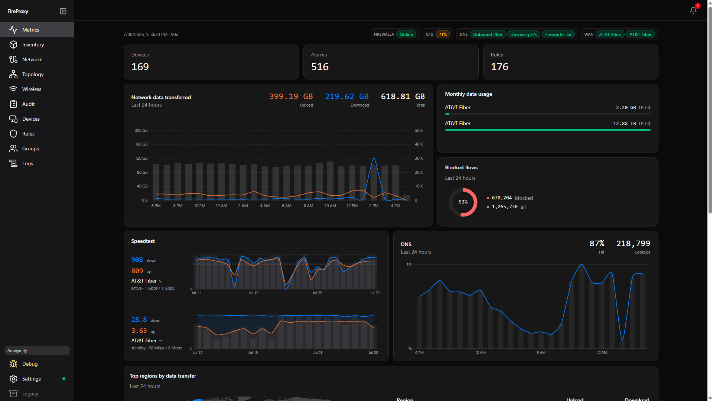
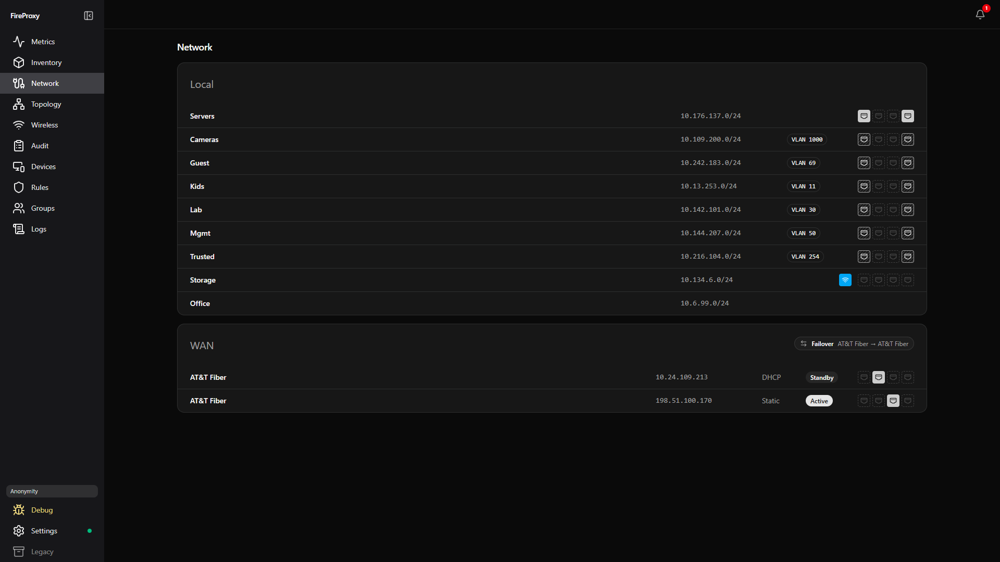
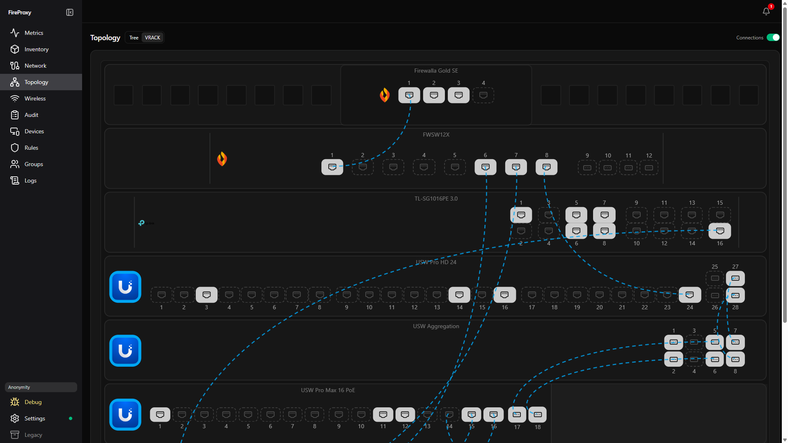
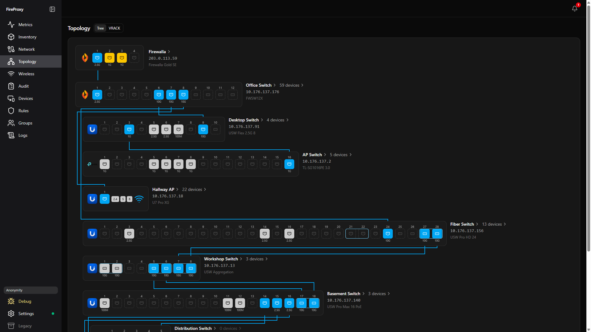
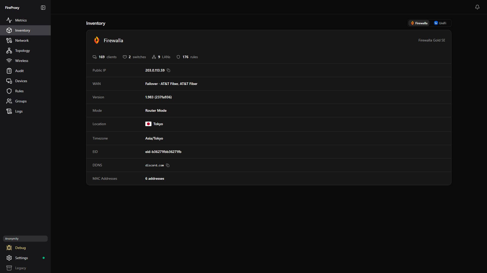
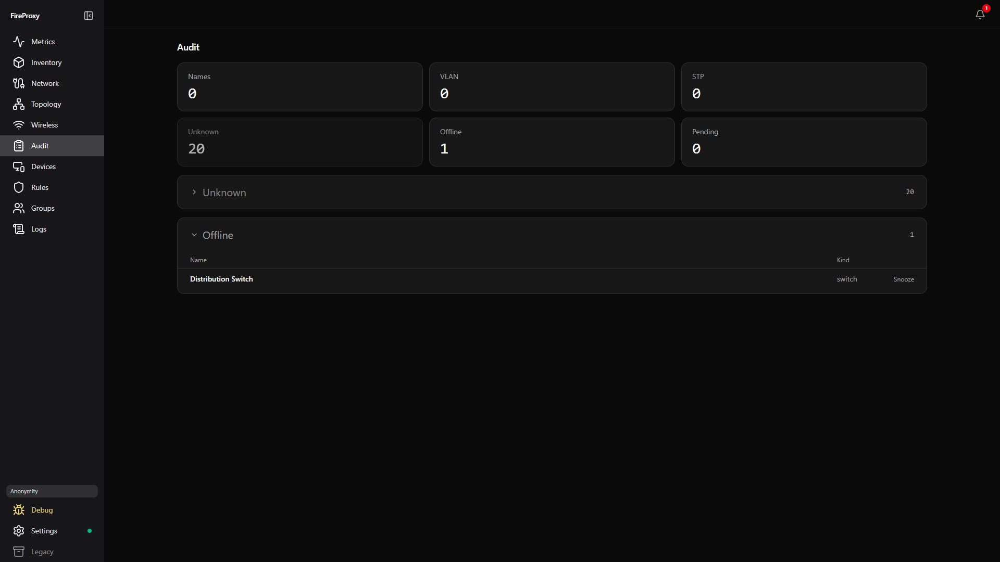

# FireProxy

FireProxy is a local companion server for [Firewalla](https://firewalla.com/) firewall and switch devices, with optional support for UniFi and TP Link gear.

It keeps **flows and history locally** for longer than the box exposes by default, while **hindering the Firewalla as little as possible**. You get a **local web UI** (something Firewalla itself doesn’t ship), **better topology** than the usual tools with best-guess accuracy, and a **dynamic inventory** of your network. Custom device names can **sync straight to UniFi** automatically. Early **local Firewalla control** is available too (unofficial App API; limited surface today — pair once, then talk to the box on LAN). More features are coming and if something fits this build, please [open a feature request](https://github.com/ultimaterex/fireproxy/issues/new?template=feature_request.yml).

Put simply an on-box **agent** pushes snapshots to an off-box **server** which stores history and hosts sync/control modules; the **UI** serves MSP-style rollups, topology, wireless, audit, live logs, and Settings for optional modules.

[](./LICENSE)



## Features

- **Longer local history** — retain flows and metrics on *your* server, not only what’s convenient on-box
- **MSP-style metrics** — devices, alarms, rules, WAN speedtests, blocked flows, DNS health, region map
- **Topology + VRACK** — Firewalla, UniFi, and TP-Link switches/APs as faceplates (best-guess merge)
- **Dynamic inventory** — Firewalla box identity and UniFi console side by side
- **Wireless** — APs, SSIDs, and clients from UniFi enrichment
- **UniFi name sync** — push custom device names to UniFi automatically (optional write)
- **Audit** — name drift, VLAN/STP issues, unknown/offline gear, with snooze
- **Live service logs** — unbound / dnsmasq / firerouter via agent WebSocket
- **Firewalla control (early)** — pair via Settings → Control; LAN App API for ping, WAN speedtest, Wake-on-LAN, host rename, and local DNS hostname (more coming; unofficial)
- **Auth by default** — password admin, optional OIDC (e.g. Pocket ID), scoped API keys, per-agent enroll tokens
- **Anonymity mode** — scrub hostnames/MACs/IPs for screenshots
- **Lean agent** — `CPUQuota=5%`, `MemoryMax=64M`, no Redis `KEYS`/`SCAN`, dig, or Zeek

## Architecture

| Piece | Role |
|-------|------|
| **Agent** | Runs on the Firewalla. Reads sysfs + a few Redis keys; POSTs snapshots; optional self-update |
| **Server** | Ingest, SQLite history, UniFi/TP-Link/Firewalla-control modules, auth, enroll, API (Docker) |
| **UI** | Local web UI over the Server API (nginx in Compose) |

## Run with Docker Compose (recommended)

This is the primary way to run FireProxy. The agent still installs on the Firewalla; only the **server + UI** run in Compose.

**Requirements:** Docker Engine with Compose v2, and a host that can reach your Firewalla (and UniFi, if you use that module).

### Production — pull images from GHCR

No need to build from source. Grab the Compose file and env example, then pull:

```bash
mkdir fireproxy && cd fireproxy
curl -fsSLO https://raw.githubusercontent.com/ultimaterex/fireproxy/master/docker-compose.yml
curl -fsSLO https://raw.githubusercontent.com/ultimaterex/fireproxy/master/.env.example
cp .env.example .env
```

(Or `git clone` the repo if you prefer.)

Edit `.env` at least:

```bash
# Production (recommended on a real host):
#   AUTH_PASSWORD=…          # required when auth is on
#   AUTH_DISABLED=            # leave unset / empty — do not set true on a shared host
#   FIREPROXY_SECRETS_KEY=$(openssl rand -hex 32)
#
# Optional UniFi enrichment + name sync:
#   UNIFI_BASE_URL=https://unifi.lan:11443
#   UNIFI_API_KEY=…
#
# Behind a reverse proxy with TLS:
#   AUTH_TRUSTED_PROXY=true
#   AUTH_PUBLIC_ORIGIN=https://fireproxy.example
#
# Pin a release (optional; default is latest):
#   FIREPROXY_TAG=0.1.0
#
# Local only:
#   AUTH_DISABLED=true
```

Start the stack (pulls `ghcr.io/ultimaterex/fireproxy/server` and `…/ui`):

```bash
docker compose up -d
```

| Service | URL |
|---------|-----|
| **UI** | http://localhost:3080 |
| **API** | http://localhost:8081 |

Data (SQLite history, encrypted module secrets) lives in the `fireproxy-data` Docker volume.

### Local / contributor — build from this repo

```bash
git clone https://github.com/ultimaterex/fireproxy.git
cd fireproxy
cp .env.example .env
docker compose -f docker-compose.dev.yml up -d --build
```

### Enroll the Firewalla agent

1. Open the UI → **Settings → Firewalla → Generate command** (short-lived enroll code).
2. Run the printed one-liner on the box (install script verifies the agent **SHA-256** and installs a capped systemd unit).
3. Confirm the agent shows online in Settings.

Supported agent targets: Firewalla Gold SE and other models that can run the pure-Go agent under `CPUQuota=5%` / `MemoryMax=64M`.

### Production notes

1. Auth is **on by default** — set `AUTH_PASSWORD`; never leave `AUTH_DISABLED=true` on a shared host.
2. Put **TLS** (reverse proxy) in front of ports `3080` / `8081` (or only publish the UI and proxy to the server on the Docker network).
3. Set `AUTH_TRUSTED_PROXY=true` and `AUTH_PUBLIC_ORIGIN=https://your.host` when proxied.

Threat model and vulnerability reporting: [`SECURITY.md`](./SECURITY.md).

## Optional modules

**Firewalla control** — enable in **Settings → Firewalla → Control**. Pair with a fresh Additional Pairing QR + box LAN IP (credentials encrypted with `FIREPROXY_SECRETS_KEY`). After pairing, FireProxy talks to the box on LAN `:8833` (cloud only for the handshake). Early surface: connectivity check, WAN speedtest from Metrics, **Wake-on-LAN**, **host rename**, and **local DNS hostname** from Devices (optional UniFi name push when name sync is enabled; UniFi failures warn only). Unofficial / unsupported by Firewalla; treat writes as privileged.

**UniFi** — set `UNIFI_BASE_URL` + `UNIFI_API_KEY` (UniFi Network API key) in `.env`, or configure in Settings. Reads enrich topology, wireless, and inventory. **Name sync writes** client names to UniFi — treat that as a privileged action.

**TP-Link Easy Smart** — configure switches in Settings; credentials are encrypted at rest with `FIREPROXY_SECRETS_KEY`.

**GeoIP** — optional MaxMind GeoLite2 Country `.mmdb` for the region map. Bring your own account/DB; do not commit the file. Attribution: [`NOTICE`](./NOTICE).

## Screenshots












## Current Agent constraints

The **agent** stays read/observe-only and capped so it barely touches the box. **Control** (when you enable it) is a separate server-side path over the box App API — not via the agent.

- Designed to use as little on-box resources as possible
- Interval default 60s (floor 30s)
- No scrape server on the Firewalla
- No Redis `KEYS`/`SCAN`, dig, Zeek, or product-tree edits
- `Nice=10`, `CPUQuota=5%`, `MemoryMax=64M`

## Tested hardware

Developed and verified against this gear (other models may work; open an issue if yours doesn’t):

**Firewalla**
- Gold SE 
- Switch X

**UniFi**
- USW Pro Max 16 PoE
- USW Aggregation
- USW Pro HD 24
- USW Flex 2.5G 8
- USW Flex 2.5G 5
- U7 Pro
- U7 Pro Wall
- U7 Pro XG

**TP-Link**
- TL-SG1016PE 3.0 (Easy Smart)

## Contributing & from-source builds

Ideas that fit this project — local history, lean agent, topology/inventory, UniFi/TP-Link enrichment, expanding Firewalla control — are welcome: [open a feature request](https://github.com/ultimaterex/fireproxy/issues/new?template=feature_request.yml). I can only implement features with the hardware I have; if you want new VRACK faceplates or other ecosystems, open an issue and I’ll help.

Dev builds, tests, and CLA: [`CONTRIBUTING.md`](./CONTRIBUTING.md). To cross-compile the agent yourself:

```bash
./scripts/build-agent.sh   # linux/arm64 + amd64
```

## License

FireProxy is licensed under the **GNU Affero General Public License v3.0** (AGPL-3.0) — see [`LICENSE`](./LICENSE). If you run a modified version as a network service, AGPL section 13 requires you to offer users its source (the UI includes a **Source** link for that).

Contributions are accepted under the [Contributor License Agreement](./CLA.md). Third-party components and trademark notices are listed in [`NOTICE`](./NOTICE).

**Vendor logos are not AGPL-covered.** The Firewalla, UniFi/Ubiquiti, and TP-Link logos under `ui/public/logos/` are third-party trademarks owned by their respective companies, included only to identify hardware in the UI and **carved out** of this project's license — see the README in that folder and [`NOTICE`](./NOTICE).

> FireProxy is an independent project, not affiliated with or endorsed by Firewalla, Ubiquiti/UniFi, or TP-Link.

## About how this project is built

Large parts of FireProxy were written with coding agents. Humans planned and scoped the work, reviewed and tested the code, and spent meaningful effort hardening it toward common industry practices, but no project is perfect. If agent-assisted development is a deal-breaker for you, that is a completely fair reason not to use FireProxy.
